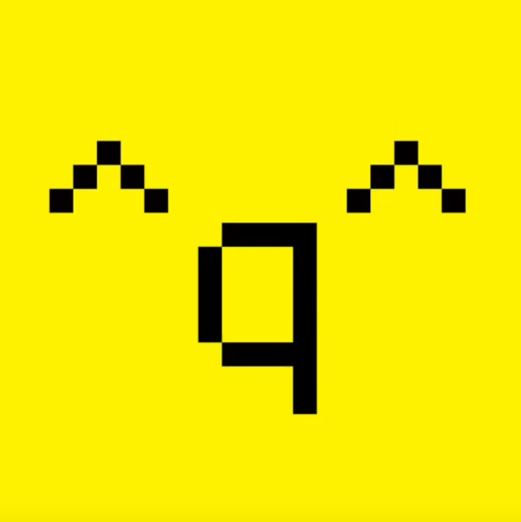

  

For this project, I created an animation for ArtFight, an annual art event where artists draw each other’s original characters for a month. The animation is a parody of the music video *Butcher Vanity*, with over 10 different OCs submitted by other participants.  

Because this was my first endeavor with animation, I had to research what animation software would allow me to accomplish what I wanted, while also being easy enough to pick up within the time I had remaining for the event. I had chosen to use alightmotion, a mobile animation software that I familiarized myself with, within a day. The process began with breaking down the original animation's music video into key poses and timing, which I then adapted into rough storyboards. Each character was then drawn and integrated with attention to their unique design while maintaining a consistent animation and art style. Lastly, I had to edit in the text and sync it with the song.

This project challenged me to balance creativity, accuracy, and efficiency, as I needed to design, sync, and animate multiple characters in a short timeframe. It also gave me practice in key-framing, and timing. You can watch the video below!

[Link to YouTube video](https://www.youtube.com/watch?v=4dY_0Q_dmSI)
