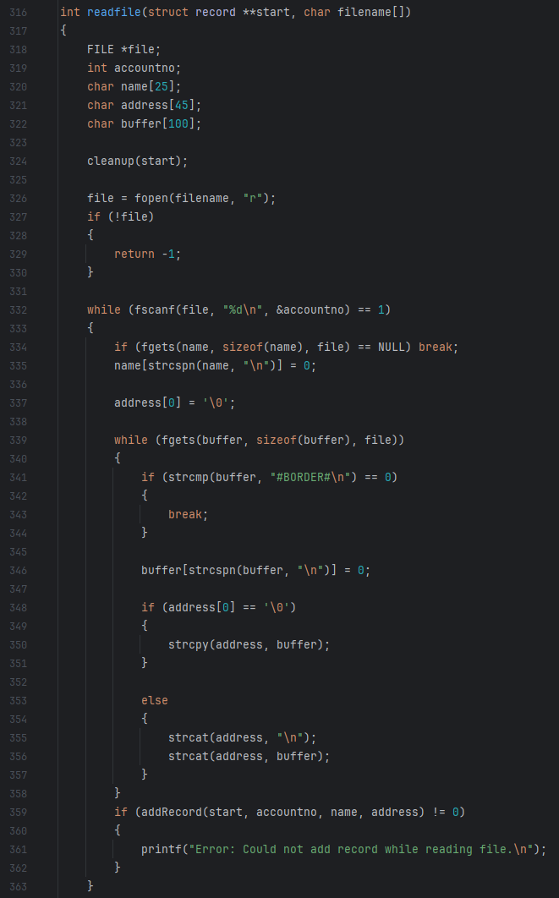

## ICS 212 Database Project

For ICS 212 we had to develop a menu-driven record-keeping system in C that stores, retrieves, updates, and deletes user records using a linked list for data management. The program supports existing entries by reading from and writing to a file called "stored_records.txt", ensuring records are maintained across different sessions. This final project for ICS 212 helped me develop a solid understanding of C and C++.
