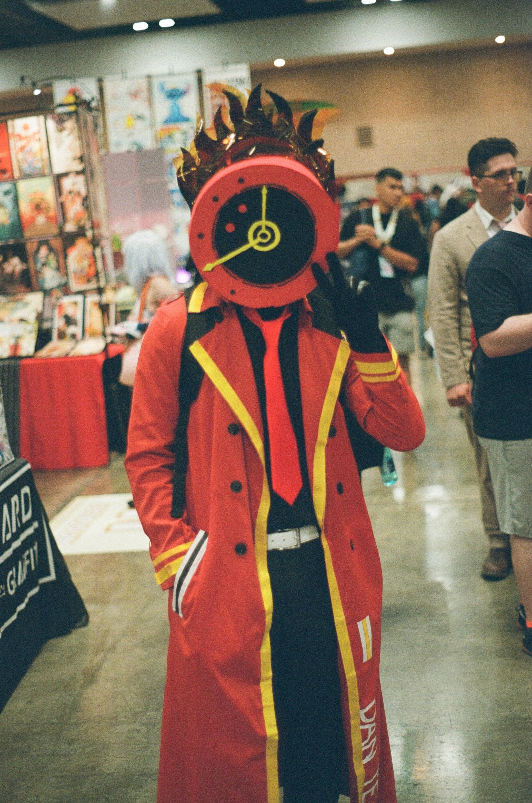
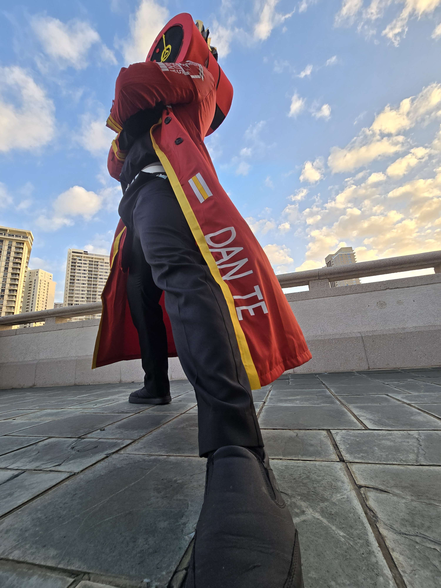
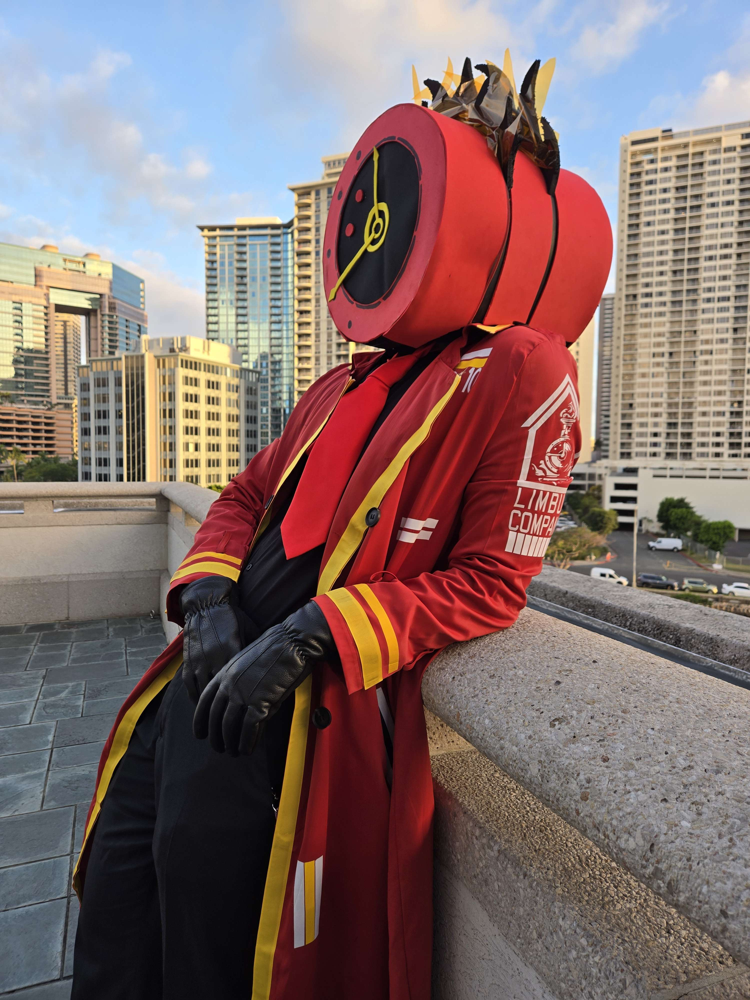

  
  
  

For this project, I set out to create a handmade costume of a character from a Korean game series. In order to do so I had to create the clock headpiece and the coat. Starting out, I had two major challenges, creating an appropriately sized clock head that allowed proper ventilation, that was visually accurate to the reference, and how I would draw and print out the various trimmings and logos onto a coat. I began researching materials and experimenting with different options before settling on a heavyweight EVA foam layer to set the structure and shape of the clock head. The choice of eva foam allowed me to easily wrap the foam into my desired shape, while also being rigid enough to not collapse in on itself.

After constructing the base of the head, I had to solve another issue, which was: how would I be able to see out the clock head while also not being able to be seen from the outside; that is how do I hide my face? After a night of research I settled on a material called buckram, it was a mesh that obscured my face enough to not be seen from the outside, but allowed limited vision from the inside.

The next challenge was how I would put the emblems, text, logos, and trimmings onto the coat without it looking like a 3-year old scribbled on it. Initially I had thought to meticulously cut out the logo from eva foam and super glue it on, but my aunt, who made custom shirts and accessories as a hobby, heard of my project and offered to help me. Through her, I communicated what I needed to do in order to finish the coat. The coat’s logos, text, and emblems were pressed on, and the trimmings were glued on.

The final iteration was completed in time for the event I was taking it to, and with much more quality than I expected! I managed to wear the costume for hours at the event without issue, and received a very positive reception from other fans of the series. This project strengthened my skills in material research, planning, prop construction, and communication.

Source: <a href="https://github.com/jogarces/ics-313-text-game"><i class="large github icon "></i>jogarces/ics-313-text-game</a>
