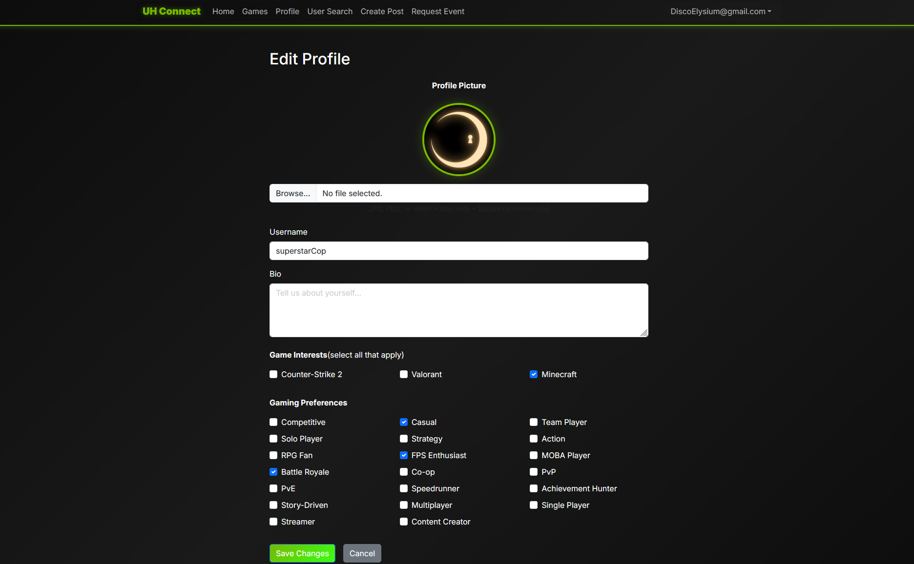

  

    

      
    

    

      
    

  

## Project Overview

UHConnect is a social media-based web application that helps student gamers at UH campuses discover and connect with other students. The web application offers common social media functionality such as: follower/following count, post creation, profile customization, and event hosting. Additionally, there is a user search engine that filters users based on relevant games, interests, and hobbies.

This web application was a final project for me and my other group members for my ICS 314 Software Engineering class. The tech stack used for this project was chosen based on what we learned in class. On the frontend we utilized React and Typescript, for the backend we used Next.js and Prisma. For deployment we made use of Vercel and Vercel's Neon PostgreSQL as our database.

## My Contributions

I contributed to both frontend and backend implementation of the application. I also acted as the project's coordinator, allocating and suggesting which team member would implement what. We decided that the work should be split up into pages, where each member would fully implement their assigned/selected page.

Below is a list of the features I and/or helped implement:

- Set up, connected, and deployed the PostgreSQL database using Vercel Neon
- Designed, implemented, and maintained Prisma schemas for user authentication/registration and profile data
- Integrated the database using Prisma ORM
- Developed the Edit Profile page
- Implemented the View Profile page
- Implemented profile picture upload functionality using Vercel Blob and PostgreSQL
- Implemented dropdown menu components for editing games and interests
- Added character limit validation for profile fields
- Implemented database-backed user search filters
- Developed filtering functionality on the User Search page
- Implemented the follower and following system
- Participated in extensive debugging, and testing of the webpage's features

## Thoughts, Experience, and Lessons Learned

I've had experience with Vercel for small personal projects related to my hobbies. However the scope and nature of this project had been very revealing for me. For starters this is the first software engineering-related project that had deadlines for deliverables, it forced me to plan out what features is and isn't reasonable to implement within the given timeframe.

Secondly, this project helped me develop experience with working in a group-based software engineering environment. Coordinating responsibilites across team members required me to manage my own workload while remaining mindful of others progress and constraints.

Finally, this project gave me a realistic understanding of how modern web applications are built and deployed. Integrating frontend components with backend logic, database management, and Github version tracking/management were the technical skills this project helped me discover and develop.

## Links

[Link to website](https://uh-connect.vercel.app/)

[Link to project home page](https://gamer-connects.github.io/)